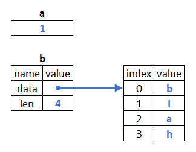
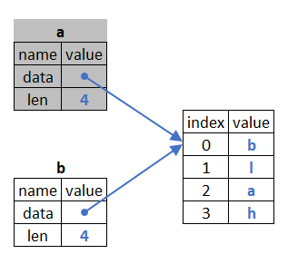
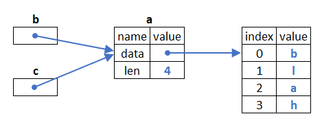

# Table of contents
1. [Introduction](#introduction)
2. [Getting Started](#getting_started)
   1. [Installation](#installation)
   2. [Hello, World!](#hello_world)
3. [Common Programming Concepts](#common_programming_concepts)
   1. [Variables](#variables)
   2. [Data Types](#data_types)
   3. [Functions](#functions)
   4. [Classes](#classes)
   5. [Templates](#templates)
   6. [Traits](#traits)
   7. [Aliases](#aliases)
   8. [Memory Allocation](#memory-allocation)
4. [Compilation Directives](#compiler_directives)
5. [Linking External Libraries](#linking_external_libraries)

# Introduction

Ragaz is a fast, safe and powerful pythonic language which allows you create systems (even operating systems) 
that are easier to read, write and maintain than other languages with the same purpose. 

It is a dialect of Python with features that allow your pythonic code run on bare metal. And this 
is possible because the compiler converts Ragaz code to binaries using LLVM as intermediate language.

Compared to other pyhtonic tools, Ragaz is faster than most of them because these tools try keep 
compatibility to Python code that is very high level but not much efficient, this force they to use a lot de 
overload to create automatic conversions among other drawbacks. Ragaz doesn't worry about keep compatibility 
with all Python features rather it forces user to strictly type her variables, encapsulate code into functions, etc. 
As a result, user has a code that is straight-forward and thus fast because it uses less instructions to run.

Furthermore, with Ragaz you don't need to reinvent the wheel, you can reuse modules compiled by other languages 
like C, C++ or Rust, without need any wrappers: you can [link](#linking_external_libraries) them with your code 
declaring these modules on dependencies file and then import them on your Ragaz file as if they were Python modules.

And to finalize, as Ragaz doesn't use GIL (Global Interpreter Lock) your code can parallely run your code in multiple 
processors, amazing not?!

With this said, this document will address the features of the language showing practical examples to you get used to 
Ragaz and start your journey.

# Getting Started

Before we start, how about install Ragaz in your machine and run the tests to see if everything is ok?!

## Installation

Bear in mind that Ragaz works on:

- Linux x86 and 64bit
- Windows (partially)

In Windows, **try/except** statements are failing because compiler's error handling need be updated to support Windows,
we are working on this. Anyway, this won't prevent you run most of the tests.

But before install Ragaz you first check if you machine have the following software installed otherwise you should
install:

- [Python 3.9](https://www.python.org/) or later
- [LLVM 12.0](https://llvm.org/) or later

And now to install Ragaz, just run the following:

    pip install ragaz

This will install Ragaz and any dependencies required by it.

To check whether installation was successful, just run the following:

    # From the root of the repo:
    ragazc test.py

If something goes wrong, visit our forum to search or ask your doubts.

## Hello, World!

To introduce you to Ragaz, how about a famous **Hello World** in Ragaz:

    def main():
        print("Hello World")

This sounds familiar with pure Python, right?! But here goes the first difference. Note the *main()* function: 
if you are compiling an executable, your first function should be it. You cannot have code scattered in the module. 
Everything must be encapsulated in functions (except constants and classes as we will see later). 

Ok, let's compile it: create a file called *hello_world.zz*, put the code into it, save it and run the following:
    
    ragazc compile examples/hello_world.zz
    
Now run the executable in your machine...

In Linux, you will use:

    ./examples/hello_world

In Windows, you will use:

    examples/hello_world.exe

And voilá, it will output:

    Hello, World!

# Common Programming Concepts

Once Ragaz have much more similarities with Python than differences, this document will not address the all features of 
Python (control flows, builtin functions, standard library, etc) but the differences: the features present in Ragaz
but not in pure Python. So if you are not a Python developer but wish know better the language, we invite you to check 
the [Python documentation](https://docs.python.org/3.9/tutorial/) to get used with it.

And if you want check the current state of implementation of the CPython features in Ragaz, see this [checklist](../developer/checklist.md).

## Variables<a name="variables">

Declaring a variable in Ragaz is pretty straightforward. An example:

    var bar = 1

If you know Java, Swift or Go language, this sounds well familiar. In the code above, the variable *bar* is declared
as an integer with value *1 (one)* (the type is inferred automatically from value). As you noted, different from pure 
Python you should use the keyword *var* in front of an assignment. *var* is a statement useful to say which type of 
value this variable can receive and so avoid problems ahead. Look the example bellow:

    var bar = 1
    bar = "blah"

This code won't compile because we declare *bar* as integer but later pass a string into it. If we want that *bar* 
begin receive strings as value, we should use other *var* to clarify this:

    var bar = 1
    bar = 2
    var bar = ""
    bar = "blah"

So from the second *var*, the compiler only will accept strings to the variable *bar*. 

In the practice, when we change the type of the variable, behind the curtains the compiler destroys the previous 
variable and create another one but with the same name. This is a good way to avoid excess of variable names 
like *bar_int*, *bar_str*, etc, and keep the code cleaner.

Let's talk about scope...

In most languages when you declare a variable in a function, it's valid in every place of the function. In Ragaz 
this not happens. See this:

    def main():
        if True:
            var bar = 1
            if True:
               print(bar)
        print(bar)

In the code above, the first *print* inside the two nested *if*s blocks will compile but not the last *print*. Why? 
Because a variable is valid only in the block which it was created (in this case, the first *if*) and its inner blocks 
after declaration (in this case, the second *if*). As *bar* was declared in an inner block, the last *print* won't 
compile and an error will be raised on compile time. To solve this problem, move the declaration to outer:

    def main():
        var bar = 1  # Declaration was moved to here; now it will compile
        if True:
            if True:
               print(bar)
        print(bar)

In addition to the local variables, you can also declare a global variable this way:
   
    BAR = 1

    def main():
        print(BAR)

In this case, you don't need use the *var* keyword; the variable will be visible to whole module as well other modules
will can import it:

    from foo import BAR

## Data Types<a name="data_types">

As Ragaz is statically typed, all variables should have their types known in compile time. Sometimes the type can
be inferred from the value is being assigned to it, but sometimes you need explicitly declare its type like:

    var bar: i8 = 1

In the example above, *bar* is declared as an integer of 8 bits (which its range goes from -128 to 127). This is 
useful for the sake of performance and memory when you need to store numbers using little memory. However, if you
assign to *bar* an integer which occupied a piece of memmory bigger than 8 bits, the compiler will raise an error:

    var bar: i8 = 32767  # 32767 occupies 16 bits of memory; the compiler will raise an error

And finally, you can declare and assign multiple variables in a same row:

    var a: i8, b = 1, "blah"

Above, while *a* is explicitly typed with *i8*, *b* is implicitly typed with *str* as it is inferred from its assignment.

### Integer types

Ragaz supports integer types of several sizes. In the tables bellow are all the integers supported by Ragaz.

**Unsigned Integers**

| Type | Minimum |   Maximum |
|:----:|--------:|----------:|
|  u8  |       0 |   2^8 - 1 |
| u16  |       0 |  2^16 - 1 |
| u32  |       0 |  2^32 - 1 |
| u64  |       0 |  2^64 - 1 |
| u128 |       0 | 2^128 - 1 |

**Signed Integers**

| Type |  Minimum |   Maximum |
|:----:|---------:|----------:|
|  i8  |   -(2^7) |   2^7 - 1 |
| i16  |  -(2^15) |  2^15 - 1 |
| i32  |  -(2^31) |  2^31 - 1 |
| i64  |  -(2^63) |  2^63 - 1 |
| i128 | -(2^127) | 2^127 - 1 |

**Generic integers**

There are two generic types that are architecture-dependent integer types which you could use when your software 
doesn't require strong typed integers: the *int* and *uint* types.

They are types with the same number of bits as the platform's pointer type (ie a minimum size of 16-bits).

Remember the first example:

    var bar = 1

The code above and the code bellow have the same effect:

    var bar: int = 1

Because once that an integer is inferred it is set to *int* by default. 

### Float types

There are two types of floats in Ragaz: *f32* and *f64*, where suffixes *32* and *64* are respectively their 
sizes in bits. 

Just as you can use generic integers, you could also use the type *float* as generic float when your software 
doesn't require strong typed floating numbers. By the way, the two codes bellow have the same effect, once that when 
a float is inferred it is set to *float* by default. 

    var bar = 2.5

    var bar: float = 2.5

### Boolean type

In Ragaz the type for store boolean types is *bool*:

    var bar: bool = True

### String type

The type for string is *str*:

    var bar: str = "blah"

### Char type

Unlike the original Python, Ragaz has a unique type for characters. To declare a *char* representing the *a* letter,
for example, you could put the character in single quotes like this:

    var c = 'a'

Or just using its *ascii* code:

    var c: char = 97

You can also extract the character from a string as shown below:

    var bar: str = "blah"
    var c: char = bar[0]

In the example above, the first element of the *bar* string is passed to *foo*. Now *foo* contains the 
*b* character.

### Array type

This is type not present in original Python. Its function is store a vector of objects (of same type) in a 
contiguous block of memory. Types like strings or lists, for instance, use this type to store internally their data.

You can create an *array* object this way:

    var a = array.<f16>(3)
    a[0] = 1.0  # element at index 0 will store 1.0 value

Where above you will have an array with *3* elements with *f16* type.

You can resize its length as shown below:

    a.resize(10)

Now the same array will have *10* elements.

### List type

> **_NOTE:_** Ragaz tries reuse the [typing format](https://docs.python.org/3/library/typing.html) 
> implemented in default Python in order to make smoother the learning curve. If you already know the type 
> hints the next sections will sound very familiar to you.

The type for list is *list* where the element type must be put between brackets:

    var bar: list<int>
    bar.append(1)

But you could initialize a list as you do in classical Python like this:

    var bar = [0, 1, 2, 3, 4]

Or this:

    var bar = [0] * 5

### Tuple type

The type for tuple is *tuple* where the elements' types must be put between brackets:

    def foo() -> tuple<int, int>:
        return (1, 2)

In the code above, *foo* function returns a tuple of two integers.

## Functions<a name="functions">

Here goes an example on how declare a function in Ragaz:

    def foo(x: i32, y: i32) -> i32
        return x + y

    def main():
        print(foo(1, 2))  # prints 3

Similar to variable declaration the arguments types are specified after semicolon and the return type after the 
arrow *->*. 

### Function type

You also can hold a function into a variable or function argument to call it later. Look this:

    def foo(x: int, y: int) -> int:
        return x + y

    def main():

        # Function passed as value to variable
        var a = foo
        print(a(1, 2))

In the example above, function *foo* was passed as value to variable *a* and then *a* is called with arguments *1* 
and *2*.

If you want pass a function parameter, you must specify the *callable* type like this:

    def bar(z: callable<<int, int>, int>):
        return z(1 , 2) 

    def foo(x: int, y: int) -> int:
        return x + y

    def main():

        # Function passed as parameter to another function
        print(bar(foo))

In the example above, function *foo* was passed as parameter to function *bar*. It is called via the *z* parameter
with arguments *1* and *2*. Note that *z* has callable type where first elements in brackets are the 
arguments types and the last one the return type.

## Classes<a name="classes">

Here goes an example on how declare a class in Ragaz:

    class Bar:
        i: i32
        
        def __init__(self, i):
            self.i = i

    def main():
        bar = Bar(1)
        print(bar.i)  # prints 1

Have you noted the difference to Python? The class attribute *i* is not declared in the constructor *__init__()* but 
above the methods. In *__init__()* method you just initialize the attribute's value.

## Templates<a name="templates">

In a language staticallly typed like Ragaz, sometimes a same class can't handle similar code for different 
types. Look this:

    class CompareIntegers:
        x: int

        def equal(self, y: int):
            return self.x == y

    class CompareStrings:
        x: str

        def equal(self, y: str):
            return self.x == y

    var compare = CompareIntegers()
    compare.x = 1
    compare.equal(2)

    var compare = CompareStrings()
    compare.x = "a"
    compare.equal("b")

In the example above, we have to create a class to compare integers and another one to compare strings. How about you 
have to create classes for every data type that you need?

To avoid this repetitive code, you could use a single *template*. In computer programming, a *template* is a 
generic class or other unit of source code that can be used as the basis for unique units of code.

A template to replace these two classes would be:

    class Compare<T>:
        x: T

        def equal(self, y: T):
            return self.x == y

Have you noted the *T* between brackets after the class name and the same *T* being used as type for 
variables and function arguments?

When you to create a instance of the class *Compare* passing the real type between brackets, all *T*'s will be replaced
to the type you specified:

    var compare = Compare.<int>()
    compare.x = 1
    compare.equal(2)

    var compare = Compare.<str>()
    compare.x = "a"
    compare.equal("b")

You can also use more than one type in the template using names like T, T2, ..., Tn, between brackets, or even use 
names of your preference.

## Traits<a name="traits">

Other feature present in Ragaz to avoid repetitive code is known as *trait*. In computer programming, a *trait* 
is a concept used in object-oriented programming, which represents a set of methods that a type must implement 
to extend the functionality of a class.

Let's go to an example of *trait*:

    trait Vehicle:
        def __str__(self) -> str

    class Motorcycle(Vehicle):
        def __str__(self) -> str:
            (some stuff)

    class Car(Vehicle):
        def __str__(self) -> str
            (some stuff)

    def print_vehicle(v: Vehicle):
        print(v)

    car = Car()
    print_vehicle(car)

In the example above, both *Motorcycle* and *Car* classes implement the *Vehicle* trait. However, each one will
implement the *__str__* method in different ways. Because this, the argument type in the *print_vehicle* function
is just the *Vehicle* trait; without it we would have to create one *print_vehicle* function for every type.

## Aliases<a name="aliases">

In programming, a type alias allows you to name an existing data type into your code to a simpler name. After a 
type alias is declared, the alias can be used instead of the existing type throughout the code. Look this:

    student = tuple<int, str, str>

    def main():
        var student1: student = (0, "David", "Ragazzi")
        var student2: student = (1, "Joseph", "Baptist")

In the code above, we just assign a tuple type (which store students's ID) to *student* alias and declare variables 
with this alias.

## Memory Allocation<a name="memory-allocation">

When we declare a variable, a piece of memory is reserved to store its value. This value can be a number, a string,
a structured type, etc. For each type of value, the compiler will handle the memory in a different way.

Look these declarations:

    def foo()
        var a = 1
        var b = "blah"

Behind the curtains, we have this in the memory:

As *a* store a tiny value as *1*, the compiler allocate only *1* byte of memory to store this value,
while it allocates a contiguous block of *4* bytes to store the *blah* string. The string *blah* is allocated in 
one part of the memory while the *b* (which is an implicit pointer) store the address of *blah*, in practical terms,
*b* is pointing to *blah*.

Because this, *by value* operations, ie operations with values like integers, floats, etc., are fast because involves 
copy a few bytes, while that operations that use contiguous blocks of memory like strings, arrays, etc., are slow 
because involves copy several bytes. This said, many times it is not worth copy a string but just use *by reference* 
operations, ie operations take its ownership or referencing a value as we see later.

Another point to be made is that different types of memory are used for each type of object as we will see now.

### Heap vs Stack Memory 

In all examples involving *by value* operations only the **stack** memory was used. A *stack* is a special area
of computer’s memory which stores temporary objects created by a function. In stack, variables are declared, stored and 
initialized during function's call. When a function is gone, the portion reversed for it in the stack also is gone.

But what if you need that a *by reference* object like a string be used *outside* from a function like this:

    def foo() -> str:
        var x = "blah"
        return x

    def main():
        var a = foo()

If *a* will be destructed when the call to *foo()* is finished, how *blah* still can be used by *b*?

This is possible because the compiler stores the *blah* string in the **heap** memory instead in the **stack** 
memory. The *heap* is a memory used by programming languages to store global variables. By default, all global 
variable are stored in heap memory space.

If you want to know more the details about *Heap* and *Stack* memory, maybe this [video](https://www.youtube.com/watch?v=_8-ht2AKyH4)
could be useful.

It's important to point out that variables allocated in the *heap* are **not** automatically released when the function
is gone, in at one time or another they must be destructed to avoid an *out of memory* runtime error. Fortunately, 
this destruction will happen when the owner of the heap-allocated value go out of scope.

### What is ownership? 

Ownership is a great way to manage memory resources (which discards a garbage collector) invented by the Rust 
creators. It allows increase the runtime speed without creating troubles common in memory allocation/deallocation.

To summarize:

* Each (heap-allocated) value has a variable that’s called its owner.
* There can only be one owner at a time.
* When the owner goes out of scope, the value will be dropped.

Let's go to an example:

    var a: str = "blah"

In the example above, as *blah* was created and associated to *a*, we say that *a* is the owner of *blah*. 

But this ownership can be changed like you will see bellow:

    var a: str = "blah"
    var b = a
    print(a)  # raises an error

If you try compile the code above, it will be raised one error indicating that *a* is not more valid in the *print* 
command. Why? Because the line *b = a* means the ownership *a*'s content, ie the *blah* string, was moved from *a* 
to *b*. And from this point, any mention to *a* will not be allowed anymore.

This is the what happens in the memory:

#### Scopes

As all variables have a lifetime, some will be destructed only when the program finished while others are destructed 
immediately when its scope is gone.

This is the case of variable *a* bellow:

    def foo():
        if True:
            var a = "blah"
            if True:
                print(a)  # prints "blah"
        print(a)  # raises an error

In the example above, *a* was declared inside in a *if* and it will be valid only in this *if* and in its nested
scopes, while that in the outsider *print* command, it will be invalid and the compiler will raise an error.  

Beyond this organize better your code, it increases performance because all local variables are destructed as soon
as they leave the scene and finally the memory resources that they used are released.

### What is borrowing?

Depending on the context, it is better *borrow* a value than own it. Look this example:

    var a: str = "blah"
    var b = &a
    var c = &a
    print(b)  # prints "blah"
    print(c)  # prints "blah"

In this case, although *a* owns *blah*, if you put a *&* character in front of *a*, you can indirectly reference 
the *blah* string. In the practice, *b* and *c* store the address of *a* which store the address of *blah*:

### Data type

A *data* pointer is internal type to store an address to a contiguous block in the memory. We can walk this memory 
space using an index in square brackets. For example, as the *str* type handle a field called *arr* which handle 
a *data* pointer, we could directly pick the characters of a string this way:

    var word = "hello"
    var letter = word.arr.data[1]
    print(letter)  # outputs 'e'
    
This example is same for:

    var word = "hello"
    var letter = word[1]
    print(letter)  # outputs 'e'

What the difference between them? The difference is that in the later one, the internal *\_\_getitem\_\_* method of the 
string will be called and the same will perform validations like *index out of range*. In the *data* field 
this won't happen (because pointers don't store number of elements) and this could rise serious problems during 
runtime. Thus, we suggest you use *data* only when safe alternatives don't fit your need.

## Compilation Directives<a name="compiler_directives">

Ragaz provides some options for you improve the safety and performance of your code. For a matter of simplicity
these options are disabled by default but you can enable them by command line. 

> **_NOTE:_** Bear in mind, that whether your code doesn't require critical performance and safety, we recommend you keep 
the default way that Python does the stuff once it is more readable by require less special characters to do the 
same thing.

### Disable Automatic Casting

By default, Ragaz performs automatic casting of variables. Look this:

    var x: int = 1
    var y: float = 2
    var z = x / y

Behind the curtains, *x* is casted to *float* and then is divided by *y* which already is a *float*.

This is the default way that Python performs arithmetics and logic operations. However you code could require a more
strict typing for some reason. In this case you can disable automatic casting via prompt using *--no-auto-cast*:

     ragazc compile example.zz --no-auto-cast

Try run this code and you will get an error informing that types don't match. To fix it just use the *as* keyword
to manually cast *x* to *float*:

    var x: int = 1
    var y: float = 2
    var z = x as float / y

and voilá!

### Check mutability

Languages like Rust have an interesting feature called mutability checking. If a variable doesn't be set as mutable,
Rust compiler will raise an error. In Ragaz this feature also is present but is disabled by default (also by a matter
of simplicity). To enable it just use via prompt *--check-mut*:

    ragazc compile example.zz --check-mut

With this option enabled, all variables susceptible to be changed *must* have a *~* keyword in front of their types
like this:

    def foo(x: ~&Bar):
        x.i = 1

Otherwise, the compiler will raise an error informing that *x* cannot be changed.

## Linking External Libraries<a name="linking_external_libraries">

You can also link binary code generated by C, C++, Rust, etc., to your binary. The first step is declare the external 
function present in the static library to a Ragaz file. As example, let's call it *c_functions.zz*:

    @extern_c
    def foo(bar: i32) -> void    

In another file called *test.zz* we import this function declaration: 

    from c_functions import foo
    foo(0)

For compile the code, it's just run something like:

     ragazc compile test.zz --libraries=[some_c_lib.a]

When you run this, the compiler will compile the *test.zz* file and link the object file generated by it against the
library object called *some_c_lib.a*. If *foo* function is not present in *some_c_lib.a*, the compiler will raise an error. 
